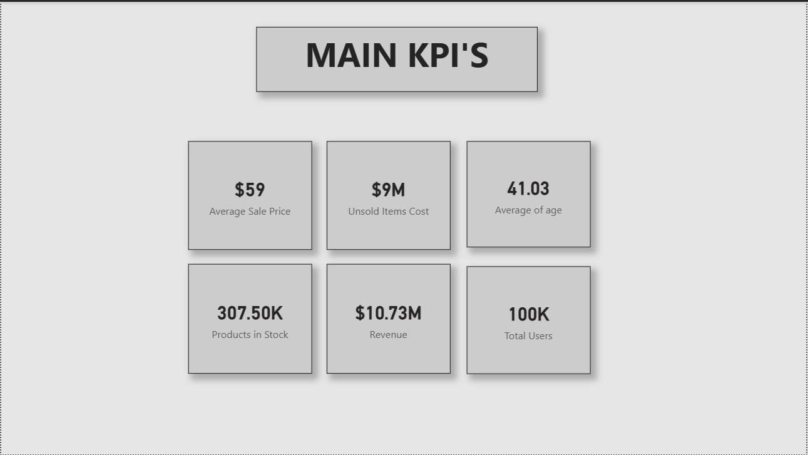
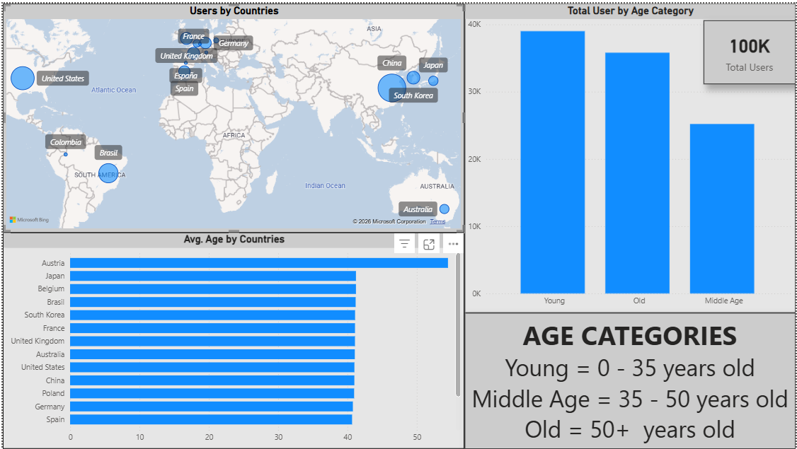
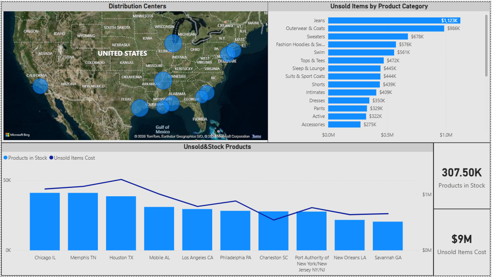

# Ecommerce-powerbi-dashboard
This project analyzes an e-commerce dataset to uncover insights related to sales performance, inventory management, and unsold products. The dashboard helps identify inefficiencies and supports data-driven decision making.

---

## Key KPIs

Average Sale Price: $59
Revenue: $10.73M
Unsold Items Cost: $9M
Products in Stock: 307.50K
Total Users: 100K
Average Age: 41.03

[View My Project](https://drive.google.com/file/d/1CJ2yoxpZof-mD3XWIiCQIVdOgYevOoy1/view?usp=sharing)

---

## Key Findings

Advertising and campaigns should be implemented to attract the middle-aged group to the market. Products targeting this age group should be highlighted.
The product range suitable for young people should be expanded. This plan should be followed by the elderly as a secondary target.
Unsold product costs are highest in certain product categories (e.g., Jeans, Outerwear). Discounts should be applied to these.
Stock levels are high in certain distribution centers despite low sales. We can open distribution centers in Asian countries, where we have the most users, in compliance with regulations, and move products that have been in stock for the longest periods there. Specific advertisements and discounts can be implemented for jeans and outerwear & coats, tailored to young people in Asia.
The trend of high stock and unsold products indicates inefficiencies in inventory planning.
Products in distribution centers should be swapped based on which region has the highest sales in which category. For example, the highest-selling product in Houston could be sent to other distribution centers as it becomes available.

---

## Tools & Technologies

* Big Query
* Power BI
* DAX
* CSV / Kaggle Dataset

---

## Sources

[Data Source](https://www.kaggle.com/datasets/mustafakeser4/looker-ecommerce-bigquery-dataset)
